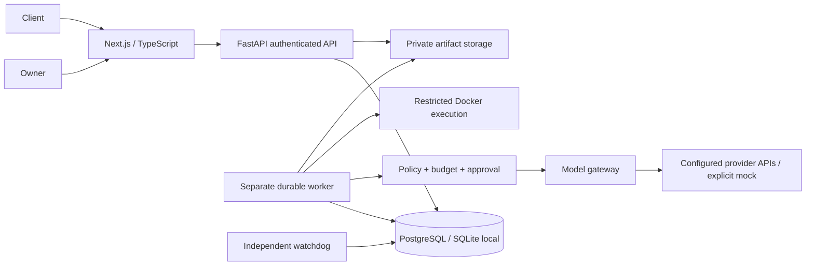
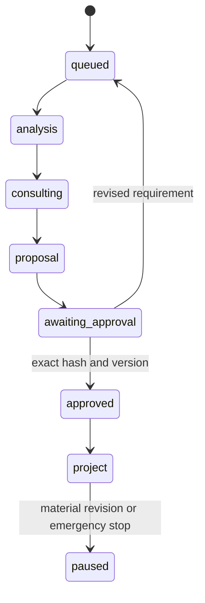
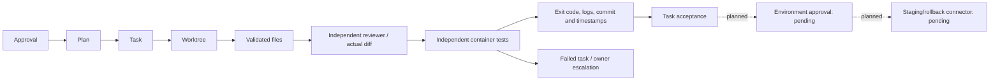
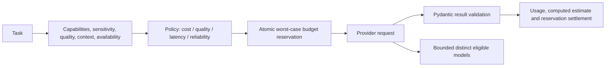
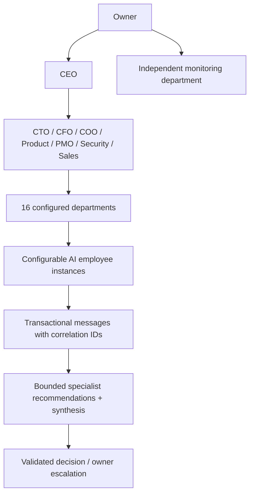
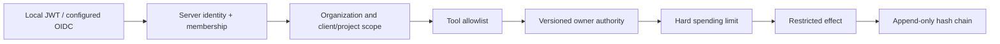
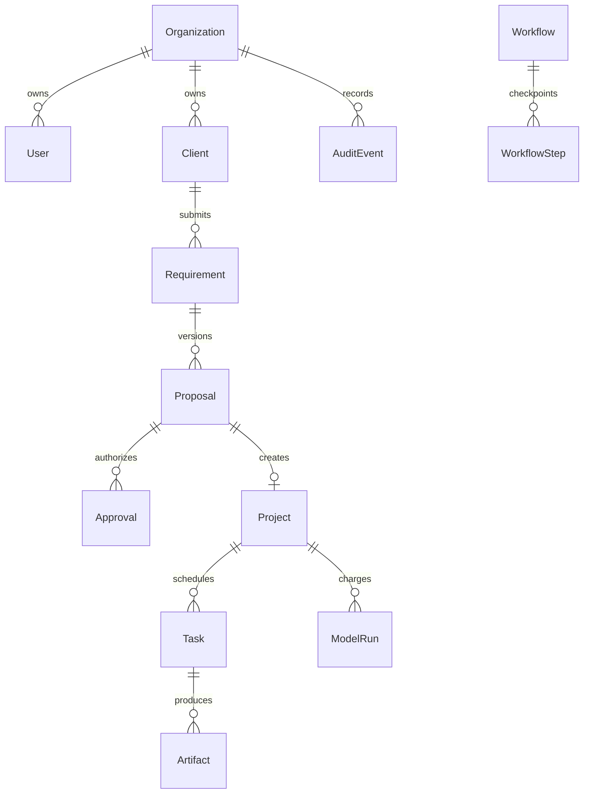
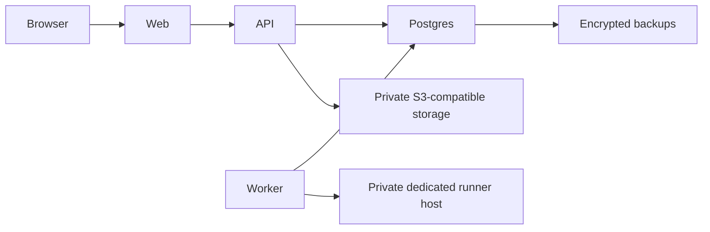
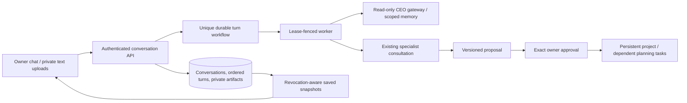

# Architecture and boundaries

## System

The backend is a modular monolith. Provider and container work runs in a separate worker. No container socket is exposed to the API or browser. Development uses SQLite WAL; Compose uses PostgreSQL. No overlapping agent frameworks are installed: typed bounded activities and server tools provide the initial runtime.

## Requirement lifecycle

## Execution / QA

## Routing

## Agent hierarchy and communication

Messages are durable records with sender, recipient, scope, correlation, status, schema and authorization context. Workflow steps use unique `(workflow, step)` keys. Completed steps are reused after restart. Claims use conditional updates and fenced lease tokens. A live request that may have reached a provider is not blindly repeated after worker death: it enters reconciliation. This is a tested database state machine, not Temporal. Adopting Temporal for distributed production orchestration remains a tracked architectural gap.

## Security / data

## Deployment

Production requires HTTPS, an OIDC identity provider, managed secrets, protected artifact storage, isolated dedicated runner hosts, backups and recovery exercises. Single-host development is not a hostile multi-tenant sandbox.

## Durable CEO workspace

Conversation/request uniqueness and optimistic versions prevent duplicate dispatch. Conversation and per-turn caps participate in the same atomic reservation transaction as company/project/agent/model/period caps. Cancelled lease tokens cannot publish delayed answers; uncertain provider usage still requires reconciliation. Consultation dispatch and its coordinator acknowledgement are committed together; no advisory text authorizes implementation.

Current SSE carries persisted workflow state, not provider tokens. The browser supports reconnect plus polling recovery. Each iteration opens a short database session and checks identity/session/expiry. Uploaded UTF-8 documents are owner-scoped private artifacts; raw HTML and remote images are suppressed in response rendering. Additive migration `771bb4c719ce` adds conversation tables/links without rebuilding populated SQLite parent tables.
